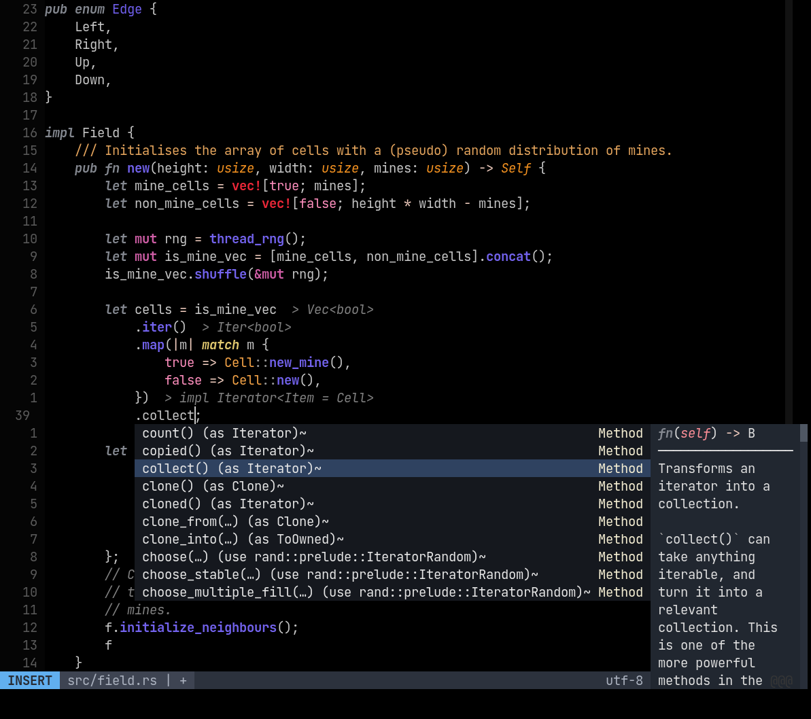

# Dot colorscheme for Neovim



## Install 

Using Plug:

```vim
Plug 'KoenWestendorp/dot-colorscheme'
Plug 'rktjmp/lush.nvim'
```

Note that the lightline theme is 'one', in the screenshot above, not of my own design. Having trouble getting lightline to recognize my theme as defined in my nvim config.
